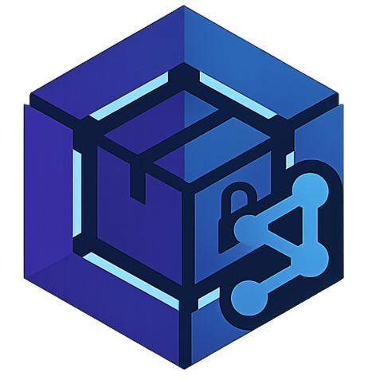

<div align="center">
  
</div>

# CeroCloud Website 🌐

[](https://github.com/CeroCloud/CeroCloud-website/actions/workflows/deploy.yml)

El sitio web oficial de **CeroCloud**, el software POS e Inventario local, seguro y de código abierto.
Este repositorio contiene el código fuente del frontend, construido con tecnologías modernas para ofrecer una experiencia rápida y accesible.

🔗 **Sitio Web:** [cerocloud.github.io/CeroCloud-website](https://cerocloud.github.io/CeroCloud-website/)

---

## 🚀 Tecnologías

Este proyecto está construido con:

* **[React](https://react.dev/)**: Biblioteca principal para la interfaz de usuario.
* **[TypeScript](https://www.typescriptlang.org/)**: Tipado estático para un código más robusto.
* **[Vite](https://vitejs.dev/)**: Empaquetador y servidor de desarrollo ultra rápido.
* **[Tailwind CSS](https://tailwindcss.com/)**: Framework de estilos utilitarios.
* **[Framer Motion](https://www.framer.com/motion/)**: Animaciones fluidas y complejas.
* **[i18next](https://www.i18next.com/)**: Internalización (i18n) para soporte multi-idioma (ES, EN, PT).
* **[Shadcn/UI](https://ui.shadcn.com/)**: Componentes de UI reutilizables y accesibles.

## 🛠️ Instalación y Desarrollo

Para ejecutar este proyecto localmente:

1. **Clonar el repositorio:**

    ```bash
    git clone https://github.com/CeroCloud/CeroCloud-website.git
    cd CeroCloud-website
    ```

2. **Instalar dependencias:**

    ```bash
    npm install
    # o
    npm ci
    ```

3. **Iniciar servidor de desarrollo:**

    ```bash
    npm run dev
    ```

    El sitio estará disponible en `http://localhost:5173`.

## 📦 Construcción (Build)

Para generar la versión de producción (que es la que se despliega en GitHub Pages):

```bash
npm run build
```

Esto generará la carpeta `dist/` con los archivos estáticos optimizados.

## 🌍 Internacionalización (i18n)

El sitio soporta múltiples idiomas. Los archivos de traducción se encuentran en `public/locales/`:

* `es`: Español (Predeterminado)
* `en`: Inglés
* `pt`: Portugués

## 🤝 Contribución

¡Las contribuciones son bienvenidas! Por favor, consulta nuestras guías de contribución en el repositorio principal o abre un Issue si encuentras algún problema.

## 📄 Licencia

Este proyecto está bajo la Licencia MIT. Consulta el archivo `LICENSE` para más detalles.
